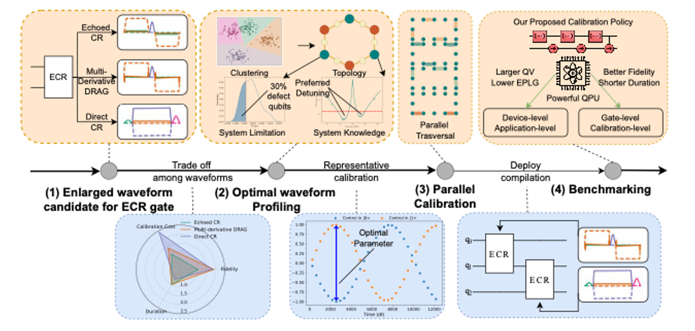

# <p align="center">[Leveraging Hardware Power through Optimal Pulse Profiling for Each Qubit Pair](https://arxiv.org/abs/2411.19308)</p>

<p align="left">
<a href="https://arxiv.org/pdf/2411.19308" alt="arXiv">
    </a>
</p>

<p align="center">
 <br>
<small>The overview of our work</small>
</p>

## Citation

```BibTeX
@misc{zhu2024leveraginghardwarepoweroptimal,
  title = {Leveraging Hardware Power through Optimal Pulse Profiling for Each Qubit Pair},
  author = {Zhu, Yuchen and Cheng, Jinglei and Li, Boxi and Zhou, Yidong and Ding, Yufei and Liang, Zhiding},
  journal = {arXiv preprint arXiv:2411.19308},
  year = {2024},
  eprint = {2411.19308},
  archiveprefix = {arXiv},
  primaryclass = {quant-ph},
  url = {https://arxiv.org/abs/2411.19308},
}
```